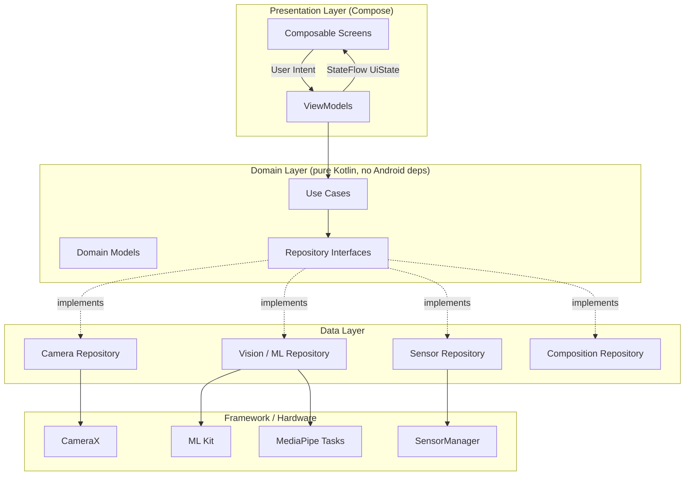
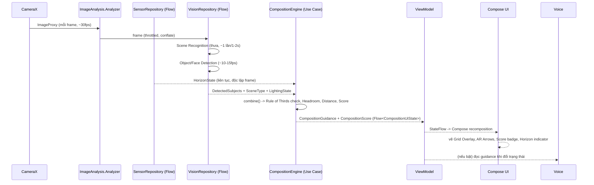
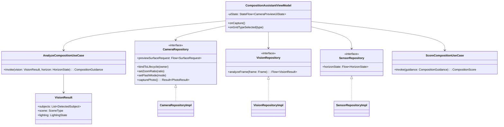

# FrameWise — AI Photography Assistant
## Phase 1: Phân tích yêu cầu & Thiết kế kiến trúc tổng thể

> Tài liệu này là sản phẩm của Phase 1. Chưa có dòng code Kotlin nào được viết.
> Mục tiêu: thống nhất kiến trúc trước khi triển khai, tránh phải sửa lại nền
> tảng ở các Phase sau.

---

## 1. Tóm tắt & góp ý về yêu cầu

Trước khi đi vào kiến trúc, có vài điểm trong yêu cầu ban đầu cần điều chỉnh
để đảm bảo tính khả thi production:

| # | Vấn đề trong yêu cầu gốc | Rủi ro nếu giữ nguyên | Đề xuất |
|---|---|---|---|
| 1 | "Ước lượng khoảng cách với chủ thể" bằng camera đơn (không LiDAR/ToF) | Không có depth sensor thật trên đa số máy Android → chỉ có thể **ước lượng tương đối** dựa trên tỉ lệ bounding box / kích thước khung hình, không phải khoảng cách mét chính xác | Đổi tên tính năng thành **"Subject Size Guidance"** (tiến gần / lùi ra dựa trên % diện tích chủ thể so với khung hình), không cam kết số liệu mét. Nếu thiết bị có ToF sensor thì dùng bổ sung như một *nice-to-have*, không phải core dependency |
| 2 | Chạy đồng thời Object Detection + Face Detection + Pose Detection + Horizon + Lighting + Scene Recognition trên **mọi frame** | Tụt FPS, nóng máy, tốn pin, có thể ANR | Thiết kế **ML Pipeline theo tầng ưu tiên + throttling**: Scene Recognition chạy thưa (vd. mỗi 1–2s), Subject/Face Detection chạy vừa (vd. 10–15 fps), Horizon (sensor) chạy liên tục vì rẻ. Có cơ chế "downsample + skip frame khi đang xử lý" |
| 3 | Voice Assistant đọc liên tục mọi hướng dẫn | Gây khó chịu, đọc chồng chéo khi hướng dẫn đổi liên tục | Voice chỉ đọc khi hướng dẫn **thay đổi trạng thái** (debounce ~1.5–2s) và có toggle bật/tắt rõ ràng, ưu tiên 1 câu ngắn tại một thời điểm |
| 4 | "AI Composition Score" chấm điểm liên tục | Điểm số nhảy liên tục gây rối mắt | Làm mượt điểm bằng moving average / low-pass filter trước khi hiển thị |
| 5 | Không nêu rõ multi-module hay single-module | Dễ rơi vào 1 file nghìn dòng nếu không có ranh giới module thực sự (package thôi không đủ ràng buộc) | Đề xuất **multi-module Gradle** ngay từ đầu (chi tiết ở mục 3) |
| 6 | ML Kit **hoặc** MediaPipe — yêu cầu chọn 1 | Mỗi lib mạnh ở mảng khác nhau | Dùng **kết hợp**: ML Kit (Object Detection, Face Detection, Barcode không cần) cho phát hiện nhanh, nhẹ; MediaPipe Tasks (Pose Landmarker) cho Pose Assistant vì ML Kit không có pose chi tiết. Cả hai đều chạy on-device, không cần mạng |

Các điểm còn lại của yêu cầu hợp lý và sẽ được giữ nguyên.

---

## 2. Kiến trúc tổng thể

**Clean Architecture 3 lớp + MVVM**, dữ liệu chảy một chiều (Unidirectional
Data Flow) bằng Kotlin Flow.



**Nguyên tắc phụ thuộc:** `presentation → domain ← data`. Domain không biết
gì về Android SDK, CameraX hay ML Kit — chỉ định nghĩa interface + model. Điều
này giúp domain layer test được 100% bằng JUnit thuần, không cần
Robolectric/Instrumented test.

---

## 3. Multi-module vs Single-module — bảng so sánh

| Tiêu chí | Single-module (package-only) | Multi-module Gradle |
|---|---|---|
| Tốc độ build lúc đầu | Nhanh hơn (project nhỏ) | Build đầu chậm hơn chút do cấu hình |
| Build incremental về sau | Compile lại toàn app mỗi lần đổi 1 dòng | Chỉ rebuild module thay đổi + module phụ thuộc → nhanh hơn đáng kể khi app lớn |
| Ép buộc ranh giới kiến trúc | Không — dev có thể import chéo bừa bãi, chỉ dựa vào tự giác | Có — `internal`/module visibility + Gradle dependency graph chặn import sai lớp |
| Rủi ro file/class phình to | Cao nếu không kỷ luật | Thấp hơn, mỗi module có phạm vi trách nhiệm rõ |
| Khả năng tái sử dụng (vd. tách SDK đo sáng, overlay ra project khác sau này) | Khó | Dễ, module đã độc lập sẵn |
| Phù hợp với yêu cầu "sẵn sàng tích hợp AI on-device trong tương lai" | Ổn nhưng chắp vá | Rất phù hợp — thêm `feature:gemini-nano` hoặc `data:tflite` không đụng code cũ |
| Độ phức tạp cho 1 người/nhóm nhỏ maintain | Thấp | Trung bình — cần convention plugin để đỡ lặp `build.gradle.kts` |

**Đề xuất: Multi-module ngay từ Phase 2**, dùng **Gradle Convention Plugins**
(`build-logic`) để tránh lặp cấu hình giữa các module. Lý do quyết định:
app này có nhiều pipeline độc lập (camera, sensor, ML, composition engine) —
đúng loại bài toán mà multi-module giải quyết tốt nhất, và yêu cầu của bạn
("không tạo file dài hàng nghìn dòng", "sẵn sàng mở rộng AI on-device")
nghiêng hẳn về hướng này.

---

## 4. Package / Module Structure

```
FrameWise/
├── build-logic/                         # Convention plugins (Gradle)
│   └── convention/
│       ├── AndroidFeatureConventionPlugin
│       ├── AndroidLibraryConventionPlugin
│       └── HiltConventionPlugin
│
├── app/                                  # Application module (thin)
│   └── framewise/
│       ├── FrameWiseApplication.kt       # @HiltAndroidApp
│       ├── MainActivity.kt               # single Activity host
│       └── navigation/
│           └── FrameWiseNavHost.kt
│
├── core/
│   ├── common/                           # Result wrapper, Dispatchers qualifiers, extensions
│   ├── designsystem/                     # Material3 theme, color tokens, typography, dark theme
│   ├── ui/                               # shared Composables (buttons, badges, shutter button)
│   ├── testing/                          # test rules, fakes dùng chung
│   └── geometry/                         # Rect/Point/Angle math thuần Kotlin (dùng cho overlay + composition)
│
├── domain/                               # Pure Kotlin module, KHÔNG phụ thuộc Android
│   ├── model/
│   │   ├── Frame.kt
│   │   ├── DetectedSubject.kt
│   │   ├── HorizonState.kt
│   │   ├── LightingState.kt
│   │   ├── SceneType.kt
│   │   ├── CompositionGuidance.kt
│   │   └── CompositionScore.kt
│   ├── repository/                       # interfaces only
│   │   ├── CameraRepository.kt
│   │   ├── VisionRepository.kt
│   │   ├── SensorRepository.kt
│   │   └── PhotographyTipsRepository.kt
│   └── usecase/
│       ├── AnalyzeCompositionUseCase.kt
│       ├── EvaluateHorizonUseCase.kt
│       ├── EvaluateLightingUseCase.kt
│       ├── DetectSubjectUseCase.kt
│       ├── RecognizeSceneUseCase.kt
│       ├── ScoreCompositionUseCase.kt
│       └── GetPhotographyTipsUseCase.kt
│
├── data/
│   ├── camera/                           # CameraX implementation of CameraRepository
│   │   ├── CameraXController.kt
│   │   ├── CameraRepositoryImpl.kt
│   │   └── di/CameraModule.kt
│   ├── sensor/                           # Accelerometer + Gyroscope fusion
│   │   ├── HorizonSensorController.kt
│   │   ├── SensorRepositoryImpl.kt
│   │   └── di/SensorModule.kt
│   ├── vision/                           # ML Kit + MediaPipe implementation of VisionRepository
│   │   ├── mlkit/
│   │   │   ├── ObjectDetectorSource.kt
│   │   │   ├── FaceDetectorSource.kt
│   │   ├── mediapipe/
│   │   │   └── PoseLandmarkerSource.kt
│   │   ├── VisionRepositoryImpl.kt
│   │   └── di/VisionModule.kt
│   └── tips/                             # local JSON/Room chứa Photography Tips theo Scene
│       ├── PhotographyTipsRepositoryImpl.kt
│       └── di/TipsModule.kt
│
├── feature/
│   ├── camerapreview/                    # CameraX PreviewView wrapper trong Compose + controls
│   │   ├── CameraPreviewScreen.kt
│   │   ├── CameraPreviewViewModel.kt
│   │   └── CameraUiState.kt
│   ├── overlay/                          # Grid overlay vẽ bằng Canvas (Rule of Thirds, Golden Ratio...)
│   │   ├── GridOverlay.kt
│   │   ├── GridType.kt
│   │   └── HorizonLevelOverlay.kt
│   ├── compositionassistant/             # Engine gộp guidance + AR arrows + score
│   │   ├── CompositionEngine.kt
│   │   ├── CompositionAssistantViewModel.kt
│   │   └── ArGuidanceOverlay.kt
│   ├── scenetips/                        # Scene Recognition badge + Photography Tips panel
│   ├── voiceassistant/                   # TextToSpeech wrapper + debounce logic
│   └── beforeafter/                      # lưu & so sánh khung hiện tại vs khung AI đề xuất
│
└── docs/
    └── PHASE_1_ARCHITECTURE.md           # tài liệu này
```

**Quy tắc phụ thuộc module (Gradle):**

```
app            → feature:*, core:designsystem
feature:*      → domain, core:ui, core:designsystem, core:common
data:*         → domain, core:common
domain         → (không phụ thuộc module Android nào)
core:*         → không phụ thuộc feature/data
```

Convention plugin sẽ enforce việc này qua `dependencies {}` — feature module
không được phép add dependency trực tiếp tới `data:vision`, chỉ được gọi qua
`domain` (Hilt sẽ bind interface → implementation ở app hoặc data module).

---

## 5. Data Flow (thời gian thực, trước khi bấm chụp)



**Điểm mấu chốt về hiệu năng:**
- `ImageAnalysis` dùng `STRATEGY_KEEP_ONLY_LATEST` để tự động drop frame cũ,
  tránh dồn ứ hàng đợi.
- Dùng `Flow.conflate()` / `sample(intervalMs)` giữa Camera → Vision để ML
  không cản trở luồng Preview (Preview render độc lập qua `Surface`, không đi
  qua Compose recomposition).
- Mọi inference chạy trên dispatcher riêng (`Dispatchers.Default` hoặc
  executor riêng cho ML Kit/MediaPipe), không bao giờ trên Main thread.
- Sensor fusion (accelerometer + gyroscope → `SensorManager.getRotationMatrix`)
  chạy nhẹ, có thể sample ở tần suất cao (SENSOR_DELAY_GAME) mà không ảnh
  hưởng FPS preview vì tách hẳn callback.
- `CompositionEngine.combine()` là hàm thuần (pure function trên dữ liệu mới
  nhất của 2 Flow qua `combine()` operator), không giữ state ẩn ngoài ViewModel.

---

## 6. UI State Management

Một `UiState` bất biến (immutable data class) duy nhất cho màn hình chụp,
theo mô hình UDF:

```
CameraPreviewUiState (root, do CameraPreviewViewModel expose)
 ├─ lensFacing: LensFacing
 ├─ flashMode: FlashMode
 ├─ zoomRatio: Float
 ├─ exposureIndex: Int
 ├─ gridType: GridType?
 ├─ horizon: HorizonUiState        (angle, level: TILTED_LEFT|TILTED_RIGHT|LEVEL)
 ├─ subjects: List<DetectedSubjectUi> (bounding box đã map sang toạ độ Compose)
 ├─ scene: SceneType
 ├─ lighting: LightingUiState
 ├─ guidance: List<GuidanceMessage>   (ưu tiên hoá, hiển thị message quan trọng nhất)
 ├─ compositionScore: CompositionScoreUi (value 0-100, reasons: List<String>)
 └─ isCapturing: Boolean
```

- ViewModel expose duy nhất `StateFlow<CameraPreviewUiState>` (kết quả
  `combine()` từ nhiều Flow con), UI chỉ đọc, không tự suy luận thêm.
- Sự kiện người dùng đi qua hàm public trên ViewModel (`onZoomChange`,
  `onGridTypeSelected`, `onCapture`, ...) — không dùng callback lambda rời rạc
  truyền sâu qua nhiều Composable.
- Guidance dùng danh sách có **priority** (vd. Horizon lệch nặng > Rule of
  Thirds > Headroom) để tránh hiển thị quá nhiều dòng hướng dẫn cùng lúc,
  đúng tinh thần "tối giản" của Sony/Fuji/Leica UI.

---

## 7. Dependency Injection (Hilt)

- `@HiltAndroidApp` tại `FrameWiseApplication`.
- Mỗi module `data:*` có `@Module @InstallIn(SingletonComponent::class)` bind
  interface domain → implementation (vd. `@Binds abstract fun bindCameraRepository(impl: CameraRepositoryImpl): CameraRepository`).
- CameraX `ProcessCameraProvider`, ML Kit detectors, MediaPipe
  `PoseLandmarker`, `SensorManager` đều là **Singleton** (khởi tạo tốn kém,
  cần sống theo vòng đời Application/Activity chứ không theo Composable).
- `ImageAnalysis.Analyzer` background executor cũng cung cấp qua Hilt bằng
  qualifier riêng (`@AnalysisDispatcher`), tách biệt với `@IoDispatcher`,
  `@DefaultDispatcher` dùng chung ở `core:common`.
- ViewModel dùng `@HiltViewModel` + `hiltViewModel()` trong Compose Navigation.

---

## 8. Navigation

Single-Activity, Compose Navigation, các màn hình chính:

```
FrameWiseNavHost
 ├─ "camera"            (màn hình chính — Preview + Overlay + Guidance, mặc định)
 ├─ "settings"          (bật/tắt overlay, voice, chọn loại grid mặc định)
 ├─ "before_after/{id}" (so sánh khung hiện tại vs khung AI đề xuất)
 └─ "tips/{sceneType}"  (chi tiết mẹo chụp theo scene, mở từ panel gợi ý)
```

Màn hình camera là trung tâm; các màn khác chỉ mở khi cần, tránh phá luồng
thời gian thực của preview khi back-navigation (dùng `rememberSaveable` /
lifecycle-aware camera binding để không phải re-init CameraX mỗi lần quay lại).

---

## 9. Camera Pipeline (CameraX)

- `Preview` use case → render trực tiếp qua `PreviewView` (AndroidView trong
  Compose) để đảm bảo FPS tối đa, **không** vẽ từng frame qua Compose Canvas
  (Canvas chỉ vẽ overlay trong suốt đè lên trên).
- `ImageAnalysis` use case (song song với Preview) → cấp frame cho Vision
  pipeline, resolution thấp hơn Preview (vd. 480p) để giảm tải ML, độc lập
  hoàn toàn với chất lượng ảnh chụp thật.
- `ImageCapture` use case → dùng khi bấm chụp, resolution cao nhất hỗ trợ.
- Camera Controls: `CameraControl.setZoomRatio`, `setLinearZoom`,
  `enableTorch`, `setExposureCompensationIndex`, `startFocusAndMetering` (tap
  to focus) — tất cả expose qua `CameraRepository` interface, che giấu chi
  tiết CameraX khỏi domain/feature.
- Lifecycle: bind use cases theo `LifecycleOwner` của Composable
  (`LocalLifecycleOwner`) để tự động unbind khi rời màn hình → tránh leak
  camera.

---

## 10. Machine Learning Pipeline

| Nhu cầu | Thư viện | Lý do chọn |
|---|---|---|
| Object Detection & Tracking (người, chó, mèo, xe, đồ vật...) | ML Kit Object Detection & Tracking (on-device) | Nhẹ, độ trễ thấp, built-in tracking giữa các frame |
| Face Detection (cho headroom, eye focus) | ML Kit Face Detection | Nhanh, trả landmark mắt để hỗ trợ "lấy nét vào mắt" |
| Pose Assistant (xoay vai, tư thế) | MediaPipe Tasks — Pose Landmarker | ML Kit không có pose chi tiết; MediaPipe cho 33 landmark, đủ để suy ra hướng vai/đầu |
| Scene Recognition | ML Kit Image Labeling (danh sách nhãn rút gọn/mapping thủ công sang `SceneType`) | Đơn giản, đủ dùng cho phân loại thô (phong cảnh/chân dung/đồ ăn/kiến trúc...); có thể thay bằng TFLite model tuỳ biến ở Phase sau nếu độ chính xác chưa đạt |
| Lighting Evaluation | Tự tính từ **histogram luminance** của `ImageProxy` (YUV → tính Y trung bình + độ lệch), không cần model ML | Rẻ, nhanh, không cần inference |
| Horizon Detection (đường chân trời trong ảnh) | Kết hợp: Sensor (accelerometer) làm nguồn chính, có thể bổ sung line detection (OpenCV) ở Phase sau nếu cần độ chính xác cao hơn khi sensor không đủ (vd. chụp macro) | Sensor rẻ và đủ tốt cho > 90% trường hợp; line detection là *enhancement*, không phải bắt buộc Phase đầu |

Tất cả detector chạy **on-device, offline**, không gửi ảnh lên server — đúng
tinh thần "sẵn sàng tích hợp AI on-device" (TFLite/MediaPipe/Gemini Nano sau
này chỉ cần thêm 1 `VisionSource` mới implement chung interface, không đổi
kiến trúc).

**VisionRepository** trừu tượng hoá 3 nguồn trên thành 1 Flow output duy nhất
cho domain, domain không biết ML Kit hay MediaPipe tồn tại.

---

## 11. Sensor Pipeline

- `SensorManager` đăng ký `TYPE_ACCELEROMETER` + `TYPE_GYROSCOPE` (hoặc dùng
  `TYPE_ROTATION_VECTOR` tổng hợp sẵn của Android nếu thiết bị hỗ trợ — ưu
  tiên dùng `TYPE_ROTATION_VECTOR` vì đã fused sẵn, giảm code tự viết
  complementary filter).
- Convert rotation vector → `SensorManager.getRotationMatrixFromVector` →
  `getOrientation` → roll angle (độ nghiêng ngang, dùng cho Horizon Level).
- Output qua `callbackFlow` → `SensorRepository.horizonState: Flow<HorizonState>`,
  áp dụng low-pass filter nhẹ để tránh rung giật kim.
- Ngưỡng: `|angle| < 0.5°` → LEVEL (hiện màu xanh như Sony/Leica),
  `0.5°–5°` → hiển thị số độ lệch cụ thể, `>5°` → cảnh báo rõ ràng hơn (màu/animation).
- Sensor Flow **độc lập hoàn toàn** với Camera/ML Flow, chỉ được `combine()`
  ở tầng `CompositionEngine`, không tạo phụ thuộc chéo.

---

## 12. Composition Engine (trái tim của app)

`CompositionEngine` (nằm ở `domain/usecase/AnalyzeCompositionUseCase`, thuần
Kotlin) nhận input từ `combine(visionFlow, sensorFlow)`  và suy ra:

1. **Rule of Thirds check** — so khoảng cách tâm bounding box chủ thể chính
   tới 4 giao điểm 1/3 gần nhất → sinh `GuidanceMessage` (trái/phải/lên/xuống).
2. **Headroom check** (chỉ khi `scene == PORTRAIT` và có face) — tỉ lệ
   khoảng trống phía trên đầu / chiều cao khung hình, so với ngưỡng lý tưởng
   (~7-10%).
3. **Subject size guidance** — % diện tích bounding box / diện tích khung
   hình, so ngưỡng để gợi ý tiến/lùi.
4. **Horizon guidance** — lấy trực tiếp từ `HorizonState`.
5. **Lighting guidance** — từ luminance histogram (thiếu sáng/thừa
   sáng/ngược sáng nếu chủ thể tối hơn hậu cảnh nhiều).
6. **Composition Score** — weighted sum của các tiêu chí trên (mỗi tiêu chí
   trừ điểm theo mức độ lệch), làm mượt qua moving average trước khi emit.
7. **Guidance prioritization** — chọn tối đa 1-2 message quan trọng nhất để
   hiển thị, tránh spam UI.

Đây là **pure function / pure use case**, dễ unit test bằng cách feed input
giả lập (`DetectedSubject` + `HorizonState` cố định) và assert output —
không cần mock CameraX hay ML Kit.

---

## 13. Class Diagram (rút gọn, các thành phần cốt lõi)



---

## 14. Hiệu năng & độ ổn định (checklist thiết kế)

- Preview render qua `PreviewView` (SurfaceView-backed) — không phụ thuộc
  Compose recomposition → giữ ≥30fps kể cả khi ML đang xử lý nặng.
- ML inference luôn có "frame đang xử lý thì bỏ qua frame mới" (không xếp
  hàng đợi) để tránh trễ dồn (lag tích luỹ).
- Toàn bộ Flow nặng dùng `flowOn(analysisDispatcher)`, chỉ `collect` trên
  Main ở lớp UI/ViewModel.
- Giải phóng `ImageProxy.close()` ngay sau khi dùng xong trong mọi nhánh
  (kể cả exception) — dùng `try/finally`.
- Camera unbind đúng lifecycle → không leak `Camera`/`Surface`.
- ML Kit/MediaPipe detector `close()` khi ViewModel `onCleared()`.
- Đo thực tế bằng `Trace`/Macrobenchmark ở Phase cuối trước khi công bố
  "đạt 30fps" thay vì chỉ ước lượng lý thuyết.

---

## 15. Lộ trình triển khai (giữ nguyên tinh thần đề xuất của bạn)

| Phase | Nội dung |
|---|---|
| 1 | Phân tích, kiến trúc, dependencies *(tài liệu này)* |
| 2 | Setup project multi-module + CameraX Preview cơ bản |
| 3 | Compose UI khung sườn (camera screen, controls, theme dark Material3) |
| 4 | Grid Overlay (Canvas) — Rule of Thirds, Golden Ratio, Golden Triangle, Square, Diagonal |
| 5 | Sensor Pipeline — Horizon Level phong cách Sony/Fuji/Leica |
| 6 | ML Kit — Object/Face Detection + Bounding Box overlay |
| 7 | Composition Engine — Rule of Thirds check, Headroom, Distance/Size guidance, Score |
| 8 | Scene Recognition + Photography Tips theo scene + Lighting Evaluation |
| 9 | AI Assistant nâng cao — AR Guidance arrows, Voice Assistant, Pose Assistant (MediaPipe) |
| 10 | Before/After, hoàn thiện UI/animation, tối ưu hiệu năng, benchmark, polish |

Mỗi Phase khi triển khai sẽ đi kèm: giải thích tiếng Việt → code production
→ hướng dẫn kiểm thử → chờ xác nhận trước khi sang Phase kế tiếp, đúng quy
trình bạn yêu cầu.

---

## 16. Việc cần bạn xác nhận trước khi sang Phase 2

1. Đồng ý phương án **multi-module Gradle** (mục 3) thay vì single-module?
2. Đồng ý các điều chỉnh yêu cầu ở mục 1 (đặc biệt điểm #1 — đổi "khoảng
   cách chính xác" thành "gợi ý theo kích thước tương đối")?
3. Đồng ý bộ thư viện ML ở mục 10 (ML Kit + MediaPipe Tasks, không phụ thuộc
   server)?
4. Tên package gốc mong muốn (vd. `com.framewise.app` hay theo domain khác)
   và `minSdk`/`targetSdk` dự kiến (đề xuất `minSdk 26` để dùng được
   CameraX + ML Kit ổn định, `targetSdk` theo phiên bản mới nhất hiện hành)?

Sau khi bạn xác nhận các mục trên, mình sẽ bắt đầu Phase 2 (setup project +
CameraX Preview).
